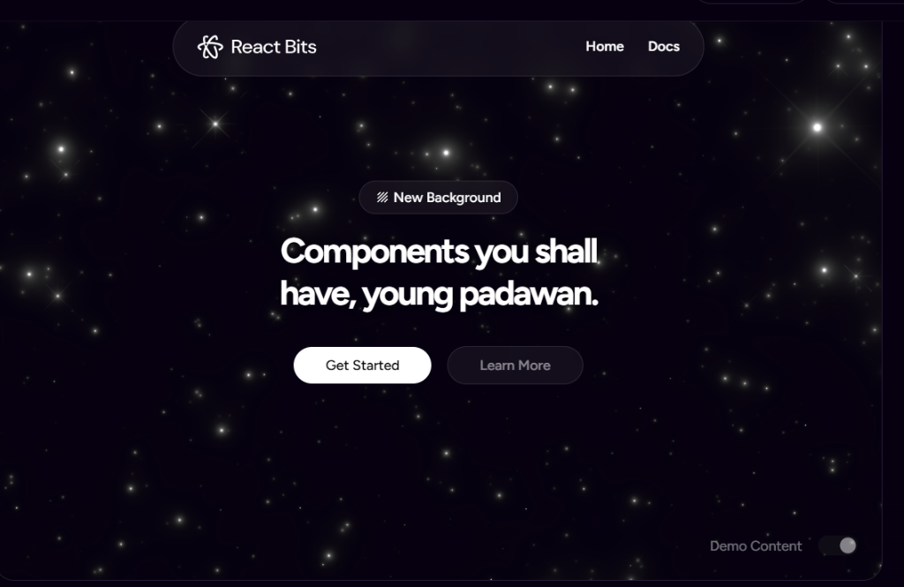
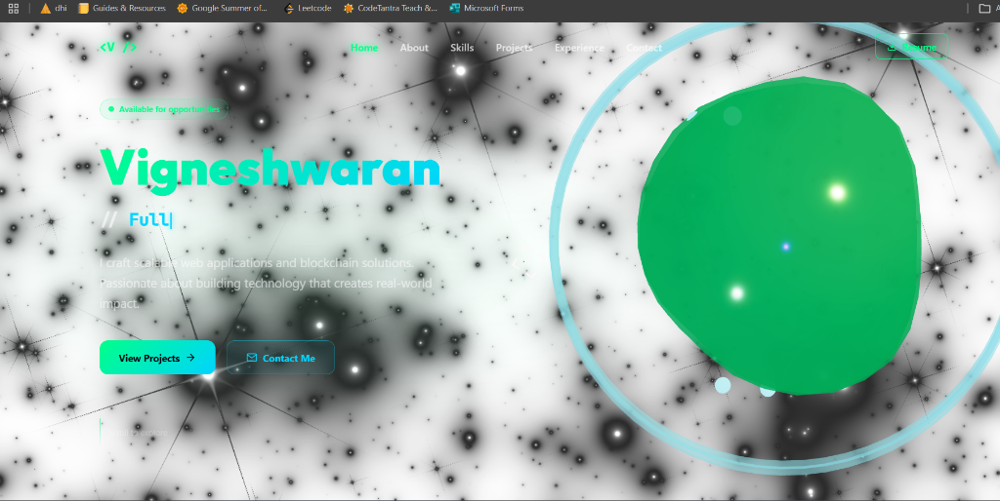
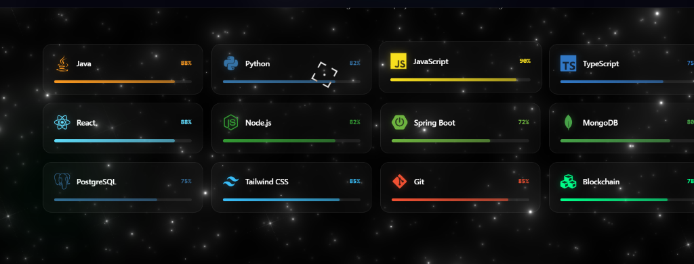
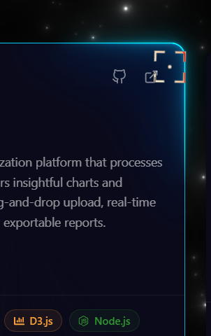

# 🚀 Vigneshwaran's Developer Portfolio

A futuristic, high-performance portfolio website built to showcase my projects, skills, and experience. It features a fully responsive design, premium dark-themed glassmorphism UI, interactive 3D elements, and butter-smooth scrolling navigation.

## 🌟 Live Demo
[Insert Your Vercel/Netlify Live Link Here]

## ✨ Key Features

- **WebGL Galaxy Background:** Stunning interactive 3D particle background tracking cursor movements across the hero section.
- **Glassmorphism UI:** Seamless semi-transparent cards with backdrop-blurs, glowing borders, and drop shadows.
- **Premium Animations:** High-end viewport intersection animations, smooth scroll easings, and typing effects powered by `framer-motion`.
- **Dynamic Projects Grid:** Fully responsive flex-grids displaying project features cleanly via quick-scan bullet points.
- **Interactive Experience Timeline:** A glowing vertical center-timeline rendering professional internships and achievements.
- **Skill Categorization:** Tech-stack grouped logically with distinct pill cards sporting exact brand-matching neon hues.

## 💻 Tech Stack

- **Framework:** [React 19](https://react.dev/) + [Vite](https://vitejs.dev/)
- **Styling:** [Tailwind CSS v4](https://tailwindcss.com/)
- **Animations:** [Framer Motion](https://www.framer.com/motion/)
- **3D Particles:** OGL (custom webgl fragment shaders)
- **Icons:** [React Icons](https://react-icons.github.io/react-icons/)
- **Hosting/Deployment:** GitHub Actions + Vercel / Netlify

## 📸 Screenshots

*(Replace these placeholder image paths with actual screenshots uploaded to your GitHub repository after you commit! I recommend adding them into a `public/screenshots` folder.)*

| Hero Section | Projects Layout |
|:---:|:---:|
|  |  |

| Interactive Skills | Professional Timeline |
|:---:|:---:|
|  |  |

## 🚀 Local Installation

1. **Clone the repository:**
   ```bash
   git clone https://github.com/Vigneshwaran2502/Portfolio-creating-page.git
   cd Portfolio-creating-page
   ```

2. **Install dependencies:**
   ```bash
   npm install
   ```

3. **Start the development server:**
   ```bash
   npm run dev
   ```

4. **Build for production:**
   ```bash
   npm run build
   ```

## 📬 Connect With Me!

- GitHub: [@Vigneshwaran2502](https://github.com/Vigneshwaran2502)
- LinkedIn: [vigneshwaran7002](https://www.linkedin.com/in/vigneshwaran7002/)
- Email: [vigneshwaran25r@gmail.com](mailto:vigneshwaran25r@gmail.com)

---
*Built with React, Tailwind, and a lot of coffee ☕.*
